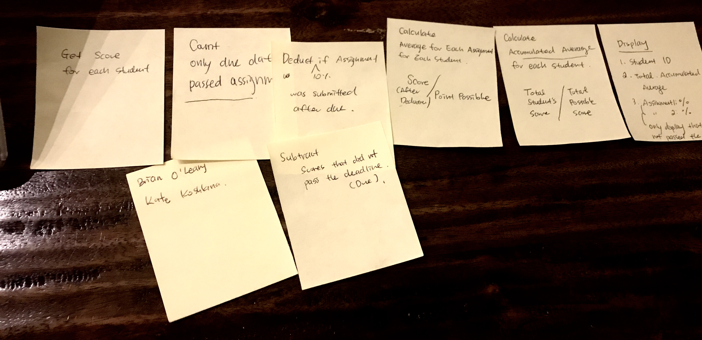
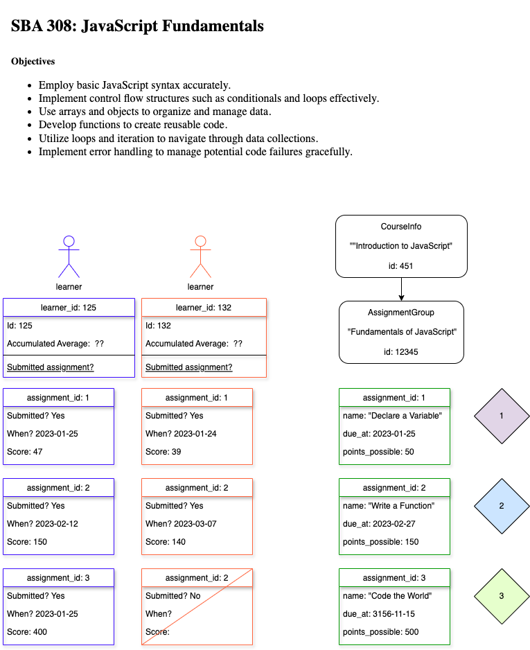

<h2 align="center">
  SBA308: JavaScript_Fundamental  
</h2>

## Main language 
- JavaScript: <code>solution.js</code> is the answer for this assignment. 

  
## Object 
- Employ basic JavaScript syntax accurately.
- Implement control flow structures such as conditionals and loops effectively.
- Use arrays and objects to organize and manage data.
- Develop functions to create reusable code.
- Utilize loops and iteration to navigate through data collections.
- Implement error handling to manage potential code failures gracefully.

## Diagram 

After receiving the assignment, I recalled the instructor's advice to approach it one step at a time. 
So, I began by jotting down each calculation required and writing out the equations on the sticky notes. 
Then, I shuffled them around to ensure the flow made sense logically and led to the final answers. 
This process was crucial as it allowed me to construct a clear picture of the scenario and better understand the complex problem.
 

Then, I rendered the diagram by utilizing diagrams.net. 

This feature is powered by [diagrams.net](https://app.diagrams.net/).

## Reflection 
Reflecting on my journey with JavaScript, I find that while I grasp the theoretical concepts well, applying that knowledge to real coding challenges has been a significant hurdle for me. Despite diligently completing all the assignments and investing extra time in studying the materials, I've found practical application to be quite challenging.

This recent assignment, in particular, really put my skills to the test. Meeting all the criteria seemed like an endless loop of reviewing and revising my code. There were moments when I felt overwhelmed by the complexity of the task at hand.

However, as I look back on this experience, I can't help but feel a sense of pride in how far I've come. Despite the challenges, I persevered and managed to write functional code. This accomplishment serves as a reminder of my growth and determination in mastering JavaScript. It's moments like these that reinforce my passion for coding and motivate me to continue pushing myself further.

## Show your support

Please give a ⭐ if you like this work. Thank you!

## License

And, of course:

MIT: <https://rem.mit-license.org>
