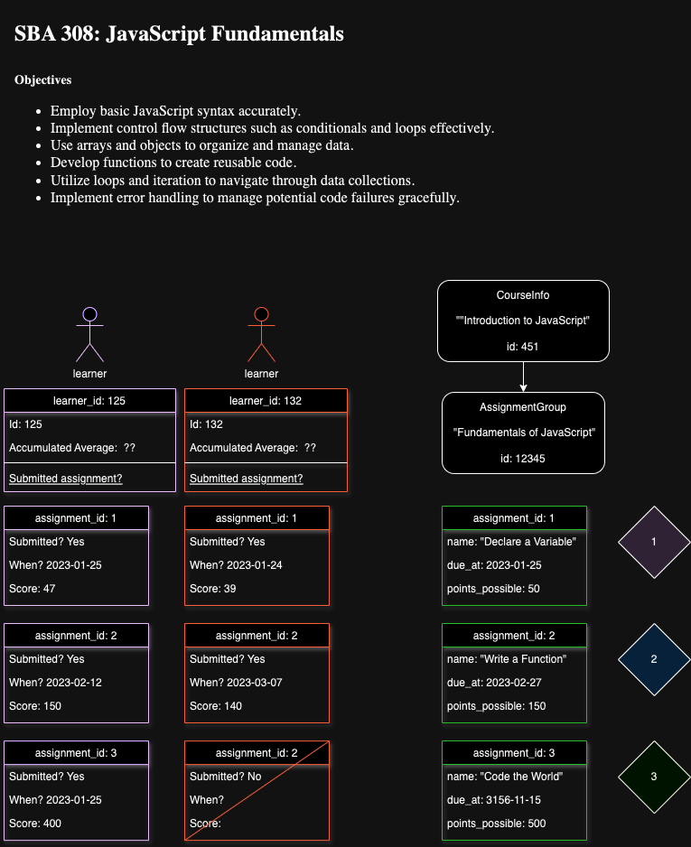

<h2 align="center">
  SBA308: JavaScript_Fundamental  
</h2>

## Main language 
- JavaScript: <code>solution.js</code> is the answer for this assignment. 
  
## Object 
- Employ basic JavaScript syntax accurately.
- Implement control flow structures such as conditionals and loops effectively.
- Use arrays and objects to organize and manage data.
- Develop functions to create reusable code.
- Utilize loops and iteration to navigate through data collections.
- Implement error handling to manage potential code failures gracefully.

## Diagram 

After receiving the assignment, I recalled the instructor's advice to approach it one step at a time. 
So, I began by jotting down each calculation required and writing out the equations on the sticky notes. 
Then, I shuffled them around to ensure the flow made sense logically and led to the final answers. 
This process was crucial as it allowed me to construct a clear picture of the scenario and better understand the complex problem.

Then, I rendered the diagram by utilizing diagrams.net. 

This feature is powered by [diagrams.net](https://app.diagrams.net/).

## Reflection 
I feel like I know the JS but when I apply the knowlege in action of writing code, I feel so much challgned by the 

## Show your support

Please give a ⭐ if you like this work. Thank you!

## License

And, of course:

MIT: <https://rem.mit-license.org>
